# Machine Predictive Maintenance MLOps 🚀

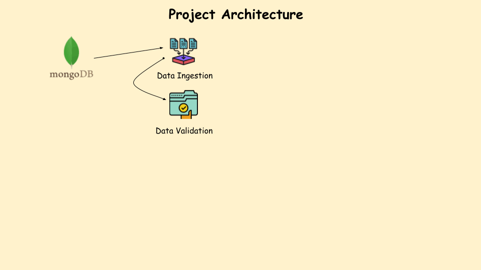


## Table of Contents 📚
1. [Problem Statement](#problem-statement-)
2. [Tech Stack](#tech-stack-️) 
3. [Training Pipeline](#training-pipeline-)
4. [Github actions - CI/CD workflow](#github-actions---cicd-workflow)
5. [AWS Integration](#aws-integration)
6. [FastAPI](#fastapi)
7. [Pre-requisites](#pre-requisites)
8. [Local Setup](#local-setup-)
9. [Running the Project](#running-the-project-️)


## Problem Statement 📝
Unplanned machine failures can cause significant downtime and financial losses in industrial settings. This project aims to develop a machine learning model that predicts the likelihood of machine failure based on historical sensor and operational data. By enabling proactive maintenance, it helps reduce costs and improve operational efficiency.


## Tech Stack 🛠️

| **Category**          | **Technology**        | **Purpose**                                                         |
|-----------------------|-----------------------|----------------------------------------------------------------     |
| Database              | MongoDB               | Used for data ingestion                                             | 
| Machine Learning Model| Classification Models |Includes Random Forest, Decision Tree, Gradient Boosting, Logistic Regression, and AdaBoost with fine-tuning            |
| Programming Language  | Python                | Core language for the entire project                                |
| Experiment Tracking   | MLflow                | Local tracking of experiments                                       |
| Framework             | FastAPI               | For building the API for batch predictions                          |
| Containerization      | Docker                | To containerize the application for consistency across environments |
| CI/CD                 | GitHub Actions        | Automates testing, building, and deployment                         |
| Cloud Storage         | AWS S3                | Stores model artifacts in the cloud                                 |
| Container Registry    | AWS ECR               | Stores Docker images for deployment                                 |
| Deployment            | AWS EC2               | Self-hosted runner for GitHub Actions, enabling deployment          |

## Training Pipeline 🚂

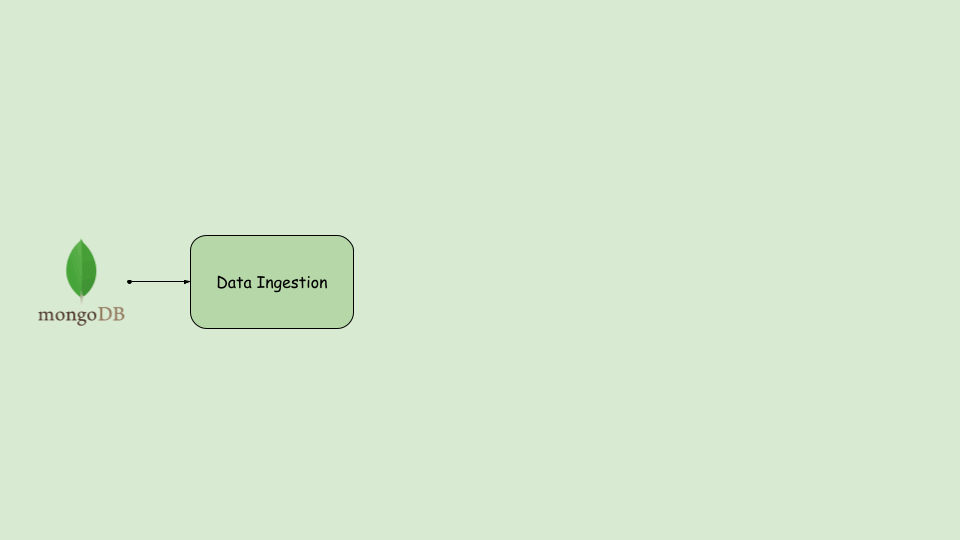 ## have to change 

The training pipeline for the Machine Predictive Maintenance project is structured into several essential stages. Each stage plays a crucial role in processing, validating, transforming the data, and ultimately training the model. Below is an overview of the pipeline stages:

### 1. **Data Ingestion**📥

The first stage of the training pipeline involves retrieving machine predictive data from a MongoDB database, cleaning it, and converting it into a Pandas DataFrame. The data is then split into training (80%) and test (20%) sets. The output is a **`DataIngestionArtifact`** containing file paths to these datasets, ready for the next pipeline stages.

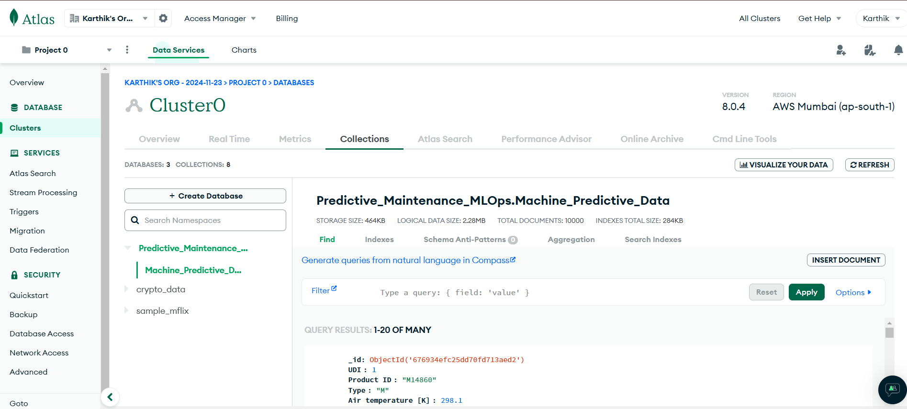

### 2. **Data Validation**✔️

The data validation stage ensures data integrity by checking for missing columns, inconsistencies, and data drift using statistical tests. It validates the data against a defined schema and produces a **`DataValidationArtifact`** with the validation status, drift report, and paths to the validated datasets.


### 3. **Data Transformation**🔄

In this phase, the raw data is prepared for modeling by applying techniques like encoding categorical variables, scaling numerical features, and addressing data imbalance using SMOTEENN. The processed training and test datasets are saved as **`.npy`** files, along with a serialized preprocessing object (**`preprocessing.pkl`**) for future use.

### 4. **Model Training and Evaluation**🤖

This stage trains machine learning models using the transformed data and evaluates them to identify the best performer. Metrics and artifacts, including the final trained model (**`model.pkl`**), are tracked using MLflow, ensuring a streamlined workflow.

- **Experiment Tracking**

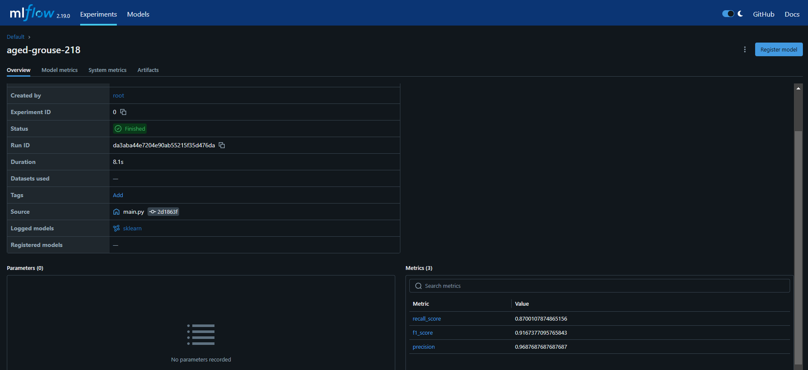 


## Github actions - CI/CD workflow 

The CI/CD pipeline is the backbone of this project, automating integration, delivery, and deployment to streamline the development lifecycle. Leveraging GitHub Actions, it ensures that every code update triggers automated workflows for testing, building, and deploying the application efficiently. By incorporating a self-hosted runner, the pipeline listens for new jobs and seamlessly deploys the latest changes, reducing manual effort and maintaining code quality throughout the process.

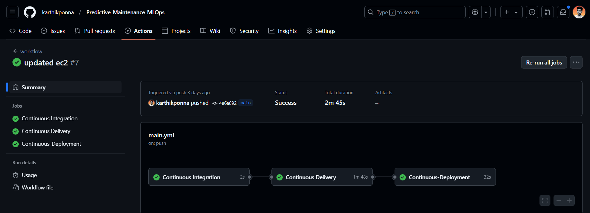


### **Continuous Integration**

On every push to the main branch (excluding updates to `README.md`), GitHub Actions automatically triggers essential tasks to ensure code integrity. This phase includes checking out the repository, linting the code, and running unit tests to validate the quality and functionality of the changes.

### **Continuous Delivery**

Once the CI steps are successfully completed, GitHub Actions prepares the application for deployment. This phase involves building a Docker image of the application, authenticating with Amazon ECR, and pushing the image to the ECR repository. This streamlined process transitions the code from development to production-ready, ensuring consistency and reliability.

### **Continuous Deployment**

The pipeline automatically deploys the latest Docker image to a self-hosted environment. It pulls the latest image from Amazon ECR, runs the container to serve users, and removes outdated Docker images and containers. This ensures that the most recent version of the application is deployed efficiently, minimizing manual effort and speeding up the release process.

## AWS Integration

- **AWS S3:**

AWS S3 stores all training pipeline artifacts, including model checkpoints, logs, and datasets, in a secure, versioned system. This makes it easy to track progress, manage iterations, and access results whenever needed.

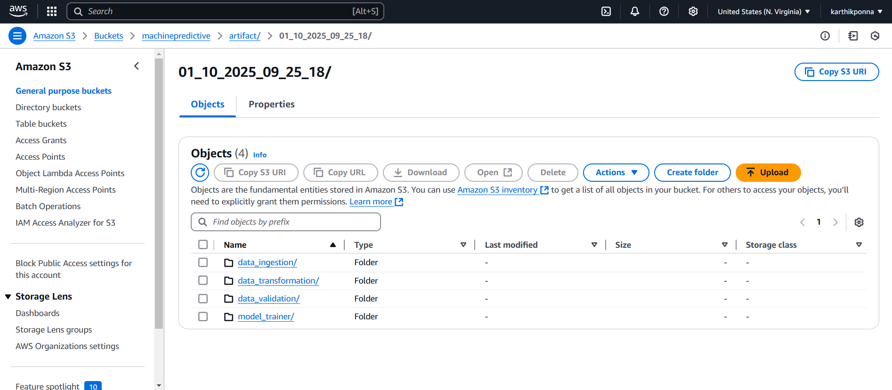

- **Amazon Elastic Container Registry (ECR):**

ECR serves as the repository for Docker images created during the Continuous Delivery phase. These images package the application, including the trained model and FastAPI interface, and are tagged and pushed to ECR for seamless deployment to production.

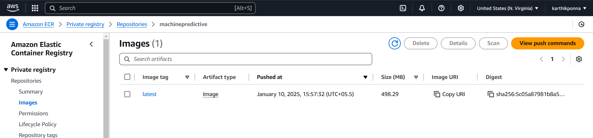

- **Amazon Elastic Compute Cloud (EC2):**

AWS EC2 instances host the application and serve batch predictions by running the latest Docker image pulled from ECR. EC2 ensures a scalable and flexible environment, enabling the application to handle varying workloads and remain responsive under different usage conditions.

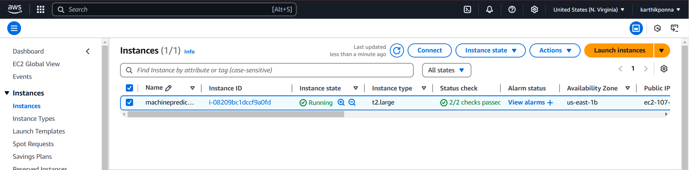

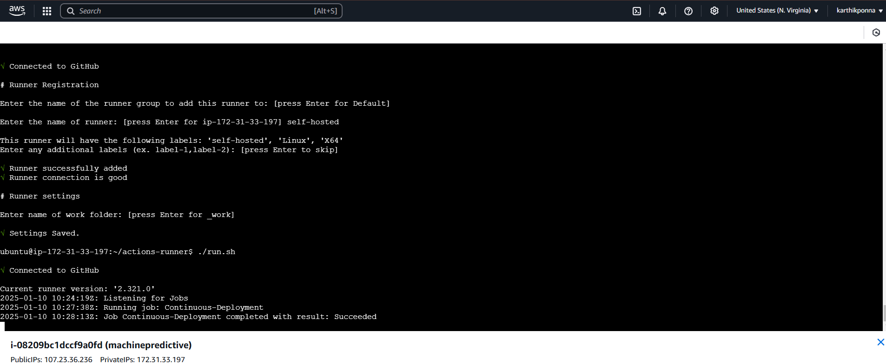

## FastAPI

FastAPI provides a RESTful API as the user interface for the deployed application. It allows users to submit data batches and receive predictions efficiently, leveraging the trained model packaged within the Docker container.

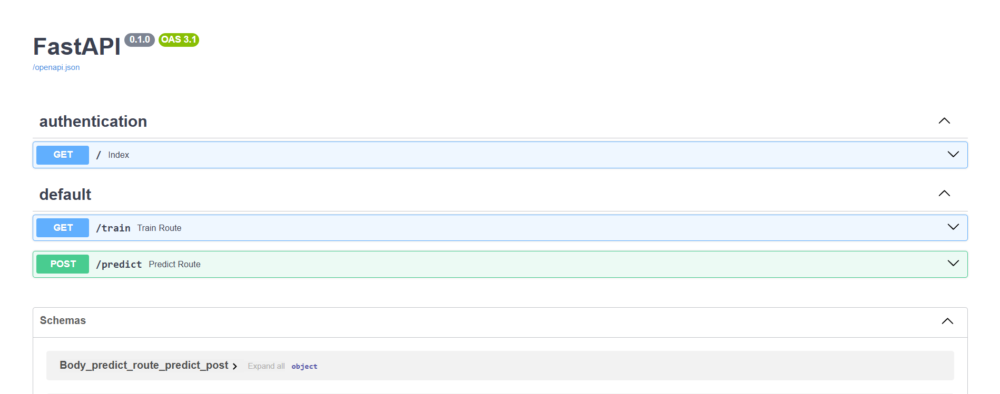

### API Routes

- **Train route:** 

The /train route is an essential endpoint that starts the machine learning model's training process. A POST request to this route triggers training with the predefined dataset and parameters. It is especially useful for retraining the model to improve accuracy or incorporate new data, ensuring the model remains up-to-date and performs optimally.

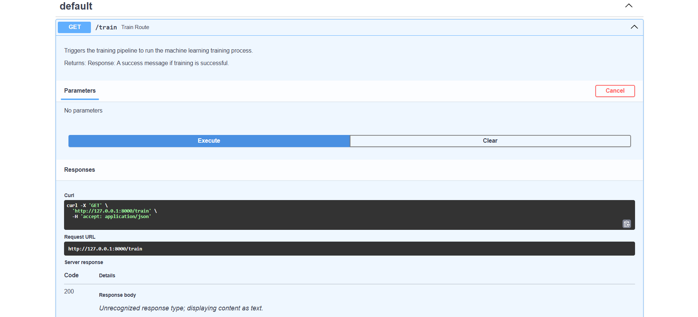

- **Predict route:**

The /predict route is designed for making batch predictions with the trained model. It accepts POST requests, where the input is a .csv file containing the data to be predicted. The route processes the data, generates predictions using the trained model, and returns the results in JSON format. This route is perfect for applying the model to new datasets, making it efficient for large-scale prediction tasks.

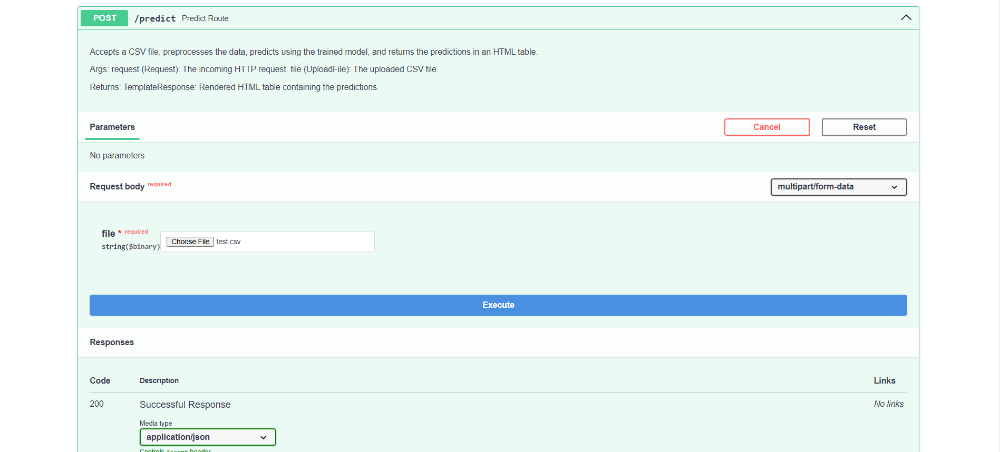

## Pre-requisites

- MongoDB
- Python 3.8+
- Docker
- GitHub Actions setup
- Cloud account (AWS/GCP/Azure)

## Local Setup 👨🏼‍💻

1. **Clone the Repository**:
```bash
git clone https://github.com/karthikponna/Predictive_Maintenance_MLOps.git
cd Predictive_Maintenance_MLOps
```

2. **Set Up a Virtual Environment**:
```bash
# For macOS and Linux:
python3 -m venv venv

# For Windows:
python -m venv venv
```

3. **Activate the Virtual Environment**:
```bash
# For macOS and Linux:
source venv/bin/activate

# For Windows:
.\venv\Scripts\activate
```

4. **Install Required Dependencies**:
```bash
pip install -r requirements.txt
```

5. **Set Up Environment Variables**:
```bash
# Create a `.env` file and add your MongoDB connection string:
MONGO_URI=your_mongodb_connection_string
```


## Running the Project 🏃‍➡️

1. **Training pipeline:**

```bash
python main.py
```

2. **To run fastapi app locally:**

```bash
uvicorn app:app --reload
```

3. **To run fastapi app on cloud**: Create AWS ECR, EC2 instance, setup github actions and run below code.

```bash
python app.py
```